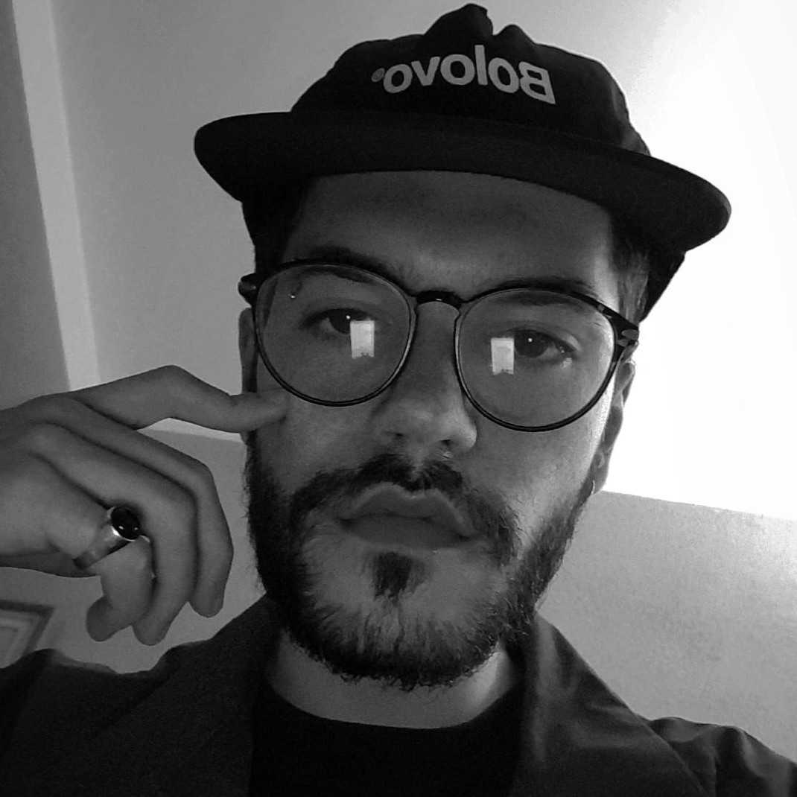
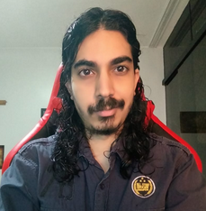

# Palestras da Game Jam FGA 

|  | Palestrante | Dia | Horário | Tema |
| - | ----------- | --- | ------- | ---- |
|  | Davi Baptista | Segunda-feira (29/08) | 09h (Remoto) | Game Design |
|  | Anthony | Terça-feira (30/08) | 10h (Remoto) | Como é montar / ter uma empresa de jogos |
|  | João Vitor | Quarta-feira (31/08) | 09h (Remoto) | Roteiro para games |
|  | Renan Ventura | Quinta-feira (01/09) | 09h (Remoto) | Trilha sonora para jogos |
|  | Alberto Miranda | Sexta-feira (02/09) | 09h (Remoto) | Mercado e oportunidades de trabalho |