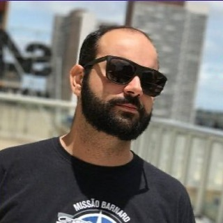

# Anthony Viana

Anthony é gerente de projetos e responsável pela área comercial da FiraSoft que trabalha há mais de 5 anos com equipes de desenvolvimento de jogos. Cursou administração e já trabalhou em diversas empresas como Google e CTIS no cargo de gestão. Por fim Anthony faz parte da comissão responsável pela criação da associação de empresas e jogos de Brasília.

## Contatos 

[linkedin](https://www.linkedin.com/in/anthony-viana-a333a723/?originalSubdomain=br)