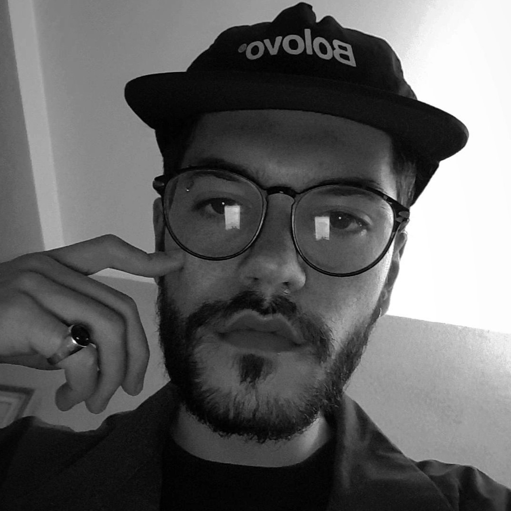

# Davi Baptista

Davi Baptista é Game Designer, com experiência em jogos mobile, PC e Xbox. Formado pela Faculdade de Informática e Administração Paulista (FIAP) em Jogos Digitais, atualmente é Game Designer na Dumativa e Cofundador e Game Designer no Nano Knight Studio. Escreve, por hobbie, sobre games e outros assuntos em seu blog pessoal, e compartilha conteúdo sobre Game Design nas redes sociais.

## Contato